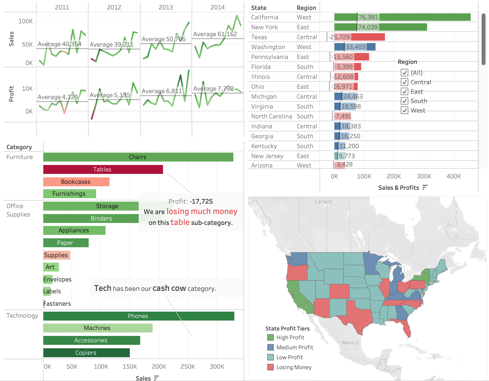
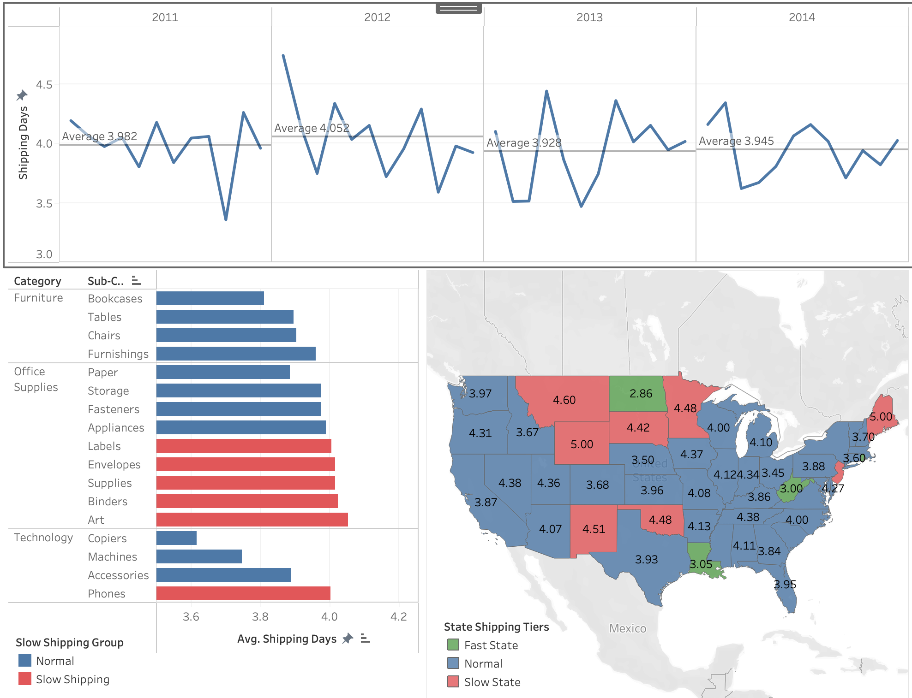
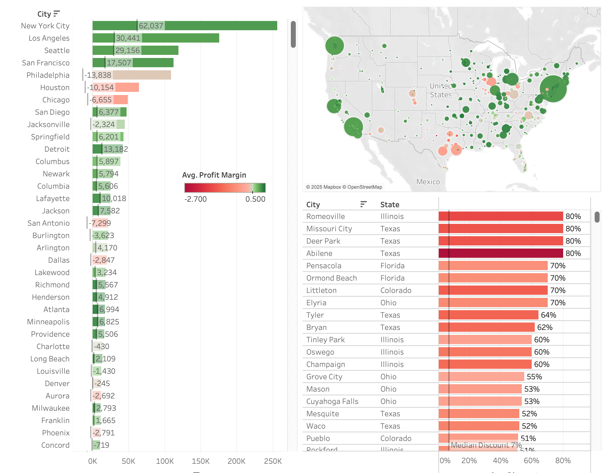
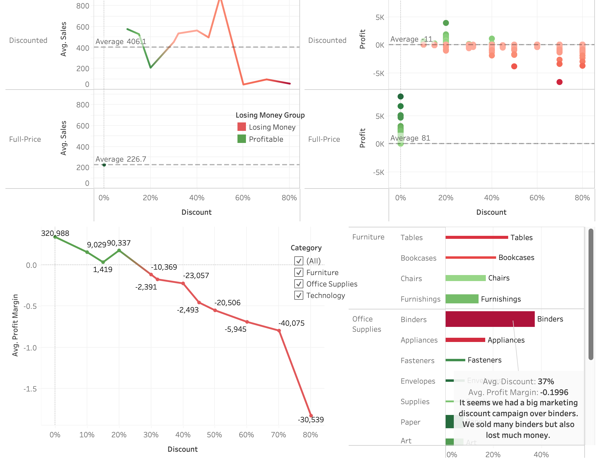

# Ecommerce Sales Storyboard
General sales/profit analysis + Key regions analysis + Deficit analysis + Logistics analysis + Discount analysis

🔍 Key Business Requirements
1)Analyze eCommerce data of past years, find out the sales/profit trend and regional performance across the U.S. to boost revenue. 
2)Find out the shipping patterns and discount patterns to improve logistics and marketing operations.

💡 Key Insights
➡️ Generally, our company's sales and profits have been on a positive trajectory.
➡️ CA and NY host most of our buyers. However, we are losing money in some states such as TX, OH, PA and IL.
➡️ NYC, LA, Seattle and SF are top profitable cities. Chicago, Denver, Phoenix and Texas cities perform badly. Discount always means losing money.
➡️ Fast shipping is strongly related to customer satisfaction. We still need to improve logistcs and warehouse operations.
➡️ Discount gives us a larger amount of sales from 226.7 to 406.1 on average. However, everytime we receive a discounted order we may lose 11 dollars.
➡️ There is something really relied on discounts to sell, such as binders, appliances, tables and bookcases and machines.
➡️ So what is the best discount rate? How to sell with a dignity price benefiting our customers as well as ourselves? From this graph, 25% is the watershed.

👉 Click here to view the interactive dashboard
📎 https://public.tableau.com/views/Rui_Peng_BAN_Final/EcommerceSalesStory?:language=zh-CN&:sid=&:redirect=auth&:display_count=n&:origin=viz_share_link

Screenshots of the dashboard (for quick reference)

